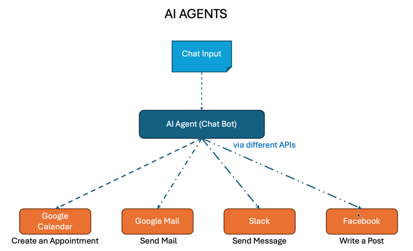
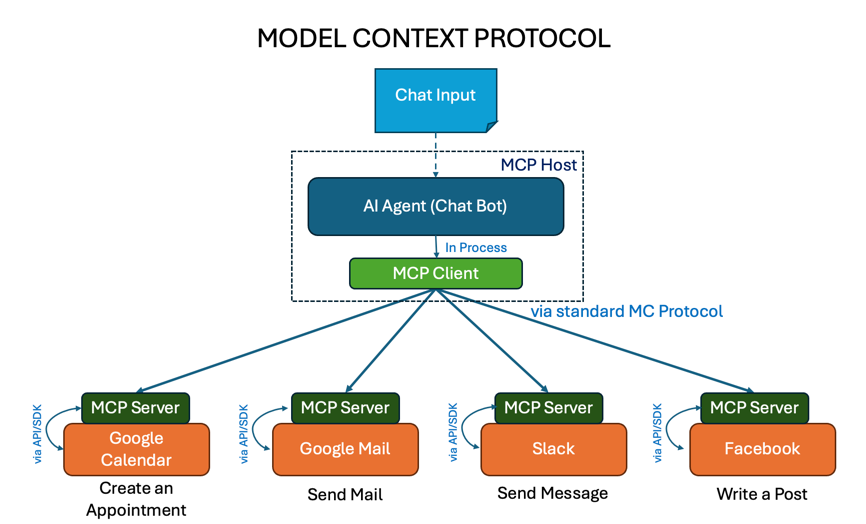
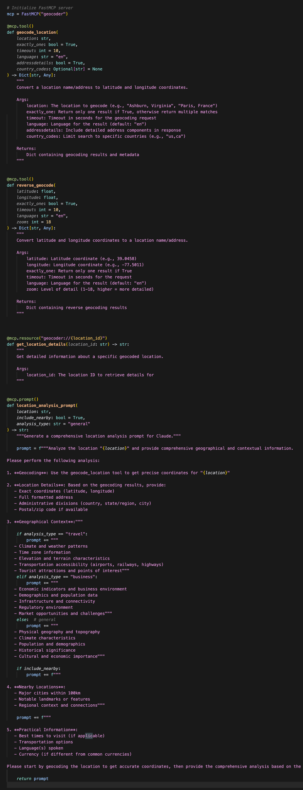
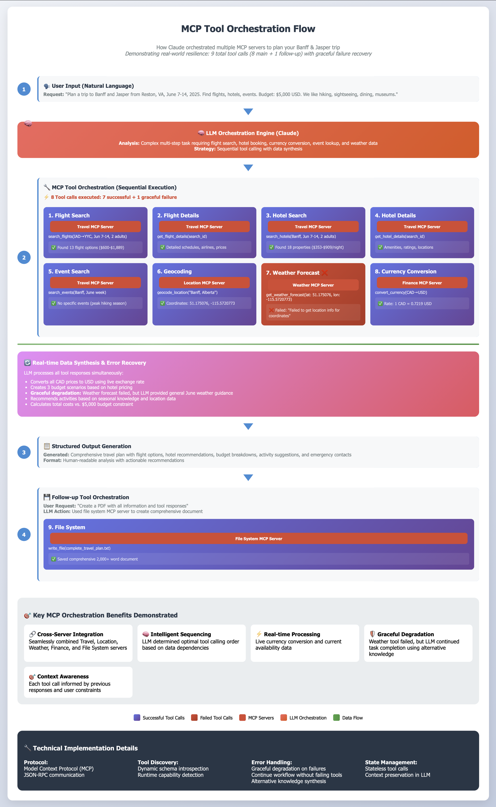

# Model Context Protocol: The Universal Standard Revolutionizing AI Integration

I have been hearing a lot about MCP (Model Context Protocol) in my feeds. So what is MCP and why is it the next big thing in AI? I set out to find out more and in the process ended up building a suite of MCP servers to help me in travel planning.

But before I jump in with the project, let us understand what MCP is (*if you would rather want to hear about the project first, head on to the section: **Real-World Project: The Intelligent Travel Assistant***).

## The Predicament that led to MCP

Apparently, the AI revolution was hitting a wall — but not the one you might expect. While LLMs have achieved breathtaking capabilities in reasoning and generation, they remain frustratingly isolated in data silos, unable to seamlessly interact with the rich ecosystem of tools and information sources that could unleash their true potential. Every new integration requires custom logic, different authentication schemes, and brittle connections that break when you need them most.

Imagine trying to build an intelligent travel assistant today. You want users to simply ask: *"Find flights, hotels and things to do for a family of two in Banff, Alberta in June considering weather conditions. My budget is $5000 USD"* and receive comprehensive, coordinated results. But to make this happen, you must manually integrate six different APIs—each with unique authentication, different data formats, inconsistent error handling, and separate rate limiting schemes. One API change breaks your entire system. Adding a new travel service requires weeks of custom integration work even with powerful agent orchestration frameworks like [LangGraph](https://www.langchain.com/langgraph).



But what if there was a way to solve this integration nightmare once and for all? What if LLMs could discover and orchestrate multiple services as easily as plugging devices into a USB-C port?

## The Dawn of Universal AI Integration

Enter the Model Context Protocol (MCP)—an open standard that has the potential to transform how AI agents interact with the world. Using MCP allows AI agents to interact with external tools and data sources by discovering, understanding, and using various capabilities provided by external systems. You no longer have to wire the orchestration.

MCP servers implement MCP protocol by providing tools, resources, and contextual information that AI assistants can use via MCP clients. Think of MCP servers as wrappers around service providers such as Google Drive for storing documents, Google Calendar for setting up appointments, Stripe for making payments etc. 

Multiple MCP Servers can be attached to a single MCP Client running on MCP Hosts such as Claude Desktop, Cursor IDE etc. This beats having to connect each service provider separately to your agent through their APIs and deal with the idiosyncrasies of each API provider.




As a result, MCP lets AI models break free from their training data prison and interact with *everything* around them in real-time!

**Here's what makes this absolutely mind-blowing:** Instead of AI being limited to generating pretty text, MCP creates a standardized bridge that connects AI to travel APIs, databases, your local files, enterprise tools - you name it! It's like giving AI superpowers to actually *do* things, not just talk about them.

**Now, picture this incredible future:** Your AI travel assistant doesn't just suggest a trip - it dynamically discovers the best travel services, orchestrates complex multi-step bookings, and adapts to new platforms seamlessly. And here's the kicker - once you give the thumbs up, it actually goes ahead and books your flights, reserves your hotels, and secures those restaurant reservations!

This isn't science fiction. This is AI finally graduating from impressive party trick to your most capable digital teammate and it's happening right now!

## Why MCP Changes Everything for Agentic AI

The current state of AI integration is a developer's nightmare. Building that intelligent travel assistant requires juggling five different authentication schemes, handling inconsistent data formats from Skyscanner, Booking.com, Viator, OpenWeatherMap, and currency APIs. When Skyscanner updates their response format, your integration breaks. Rate limits are handled differently across services. Error messages are cryptic and unhelpful. Adding a new hotel API requires weeks of custom integration work.

MCP solves these problems by introducing three game-changing innovations:

**Context-Aware Tool Discovery**: Unlike traditional APIs that require hardcoded integrations, MCP enables AI agents to dynamically discover available services. Your travel assistant powered by a LLM can find flight search tools, hotel booking capabilities, and activity recommendations at **runtime** (yes, at runtime), adapting to new services **without code changes**.

**Built-in Safety and Governance**: With AI agents making autonomous decisions across multiple services, security isn't optional. MCP includes sophisticated permission models, audit logging, and risk-based execution controls that align with enterprise security requirements—crucial when your travel assistant is handling payment information across different platforms.

**LLM-Native Design**: Every aspect of MCP is optimized for AI agents. From self-documenting tool capabilities to semantic resource descriptions, the protocol speaks the language of modern LLMs, enabling your travel assistant to understand not just what services are available, but when and how to use them effectively.

## Is MCP Replacing APIs?

MCP isn't trying to replace APIs. Rather, it is creating a new layer of abstraction that makes APIs infinitely more powerful for AI applications.

Traditional APIs excel at direct, high-performance system-to-system communication. The Skyscanner API is optimized for flight searches, Booking.com's API handles hotel reservations efficiently, and weather APIs deliver meteorological data quickly. They offer fine-grained control and benefit from decades of established patterns.

But when an LLM tries to orchestrate these APIs for a travel request, everything becomes complicated. How does the AI know without you the developer specifying that Skyscanner is better for flights while Viator excels at activities? What authentication is required for each service? How should the agent handle rate limits across multiple providers? What happens when Booking.com's API returns an error while other services succeed?

MCP addresses these challenges by providing:

- **Dynamic Service Discovery**: AI agents can explore what travel services are available before attempting bookings
- **Semantic Descriptions**: Rich metadata helps LLMs understand that flight tools should be used before hotel tools, and that weather data influences activity recommendations
- **Unified Error Handling**: Consistent patterns across all travel service integrations
- **Built-in Orchestration**: Permission models and workflow management designed for multi-service coordination
- **Graceful Degradation:**  When an agent fails, the orchestration does not break. For instance, when my Weather tool failed as I used the US Weather Service which does not provide weather forecast for Alberta, but LLM continued task completion using alternative knowledge by searching the web for weather conditions in Alberta.

The relationship is beautifully complementary. MCP servers often wrap existing travel APIs, providing an AI-friendly interface while preserving the performance and specificity of services like Skyscanner's flight search algorithms or Booking.com's inventory management.

## The Architecture That Makes It All Possible

MCP's elegance lies in its layered architecture, built on three foundational layers that work in perfect harmony:

**The Transport Layer** abstracts away communication mechanisms. Whether you're using **HTTP/HTTPS** for web-based integrations, **stdio** for local processes, or custom transports for specialized environments, the upper layers remain unchanged.

**The Protocol Layer** defines the message formats and communication patterns - for instance, **JSON/RPC**.

**The Capability Layer** is where the magic happens. This layer defines three powerful primitives that transform how AI agents interact with external systems.

But what are these primitives that make MCP so revolutionary? Let's dive into the core building blocks that are reshaping AI integration.

## The Three Primitives Powering AI Integration

MCP's power comes from three carefully designed primitives, each addressing a specific aspect of AI-system interaction:

**Resources** represent any data that an MCP server wants to make available—file contents, database schemas, API responses, even live screenshots. Each resource has a unique URI and can contain text or binary data. The key here is dynamic URIs that let AI agents construct valid resource paths programmatically. Imagine an AI that can explore a file system or database schema just by understanding the URI patterns.

**Tools** enable LLMs to take action in the real world. Unlike static API calls, MCP tools are self-describing, with rich schemas that help AI agents understand parameters, constraints, and expected outcomes. In our travel assistant example, a flight search tool doesn't just accept destination parameters—it understands seasonal preferences, budget constraints, and can even suggest alternative airports. The model-controlled design means the AI can decide when to search for flights versus when to check weather conditions first.

**Prompts** create reusable templates that guide AI behavior for specific travel scenarios. A "plan weekend getaway" prompt might include context about balancing activity types, considering weather patterns, and optimizing for budget constraints. Server authors can expose prompt libraries that turn expert travel planning knowledge into shareable, discoverable assets.

**Here is an anatomy of a sample MCP server that utilizies these three prompts:**



But here's where MCP truly shines: these primitives work together seamlessly, creating emergent capabilities that are greater than the sum of their parts.

---

## Real-World Project: The Intelligent Travel Assistant

Enough theory. Nothing illustrates MCP's transformative power better than building an intelligent travel assistant. Imagine asking a simple question: *"Find flights, hotels and things to do for a family of two in Banff, Alberta in June considering weather conditions. My budget is $5000 USD"* and watching as your AI agent seamlessly orchestrates multiple services to deliver a comprehensive travel plan.

This scenario should perfectly showcase the dramatic difference between traditional API integration nightmares and MCP's elegant orchestration capabilities. Or will it?

I wanted to find out the hard way. So I first took the course on MCP from the trusted source for learning AI: Andrew Ng's DeepLearning Institute. They have a fantastic course on [MCP](https://bit.ly/4kK0zL7). Check it out. Having built a Research Server using the course, I turned to building my own travel assistant suite.

My [Travel Assistant MCP Ecosystem](https://github.com/skarlekar/mcp_travelassistant.git) consists of six specialized servers that work in harmony:

* **🛫 Flight Search Server** - Find and compare flights, analyze pricing, filter by preferences
* **🏨 Hotel Search Server** - Discover accommodations, compare amenities, filter by budget and preferences
* **🎭 Event Search Server** - Find local events, festivals, and activities
* **🗺️ Geocoder Server** - Convert locations to coordinates, calculate distances, reverse geocoding
* **🌤️ Weather Search Server** - Get forecasts, current conditions, weather alerts
* **💰 Finance Search Server** - Currency conversion, exchange rates, financial analysis

For Flight Search, Hotel Search, Event Search and Finance Search, I used Google's services using [SERPAPI](https://serpapi.com/search-api). For Geocoder, I used the free [Nominatim](https://nominatim.openstreetmap.org/ui/search.html) service. For Weather Forecasts, I used [National Weather Service](https://api.weather.gov) API. All of these APIs were wrapped by my [MCP servers](https://github.com/skarlekar/mcp_travelassistant.git).

---

 **My** **User Request** : *"I am planning a trip to Banff and Jasper in Alberta from Reston, Virginia during June 7th 2025 to June 14th 2025. Find flights, hotels and events that are happening in Banff, Alberta and things to do for me and my wife during the time based on weather conditions. We like to hike, go sight-seeing, dining, and going to museums. My budget is $5000 USD. Make sure to convert cost from Canadian dollars to USD before presenting."*

### 🎼 Orchestrated Response Sequence

Here's how Claude orchestrates the MCP servers to fulfill this complex request:



#### Step 1: Flight Discovery ✈️

* Use the **Flight Server** to search for flights from the nearest airport to Reston, VA (e.g., IAD) to Calgary, AB (nearest to Banff/Jasper) for the specified dates.
* Filter by price, duration, and preferred airlines.
* Retrieve detailed flight information, including layovers, baggage policies, and total cost

#### Step 2: Accommodation Search 🏨

* Use the **Hotel Server** to find hotels or vacation rentals in Banff and Jasper for the trip dates.
* Filter by price, amenities (e.g., free WiFi, breakfast), and guest ratings.
* Retrieve detailed property information, compare top options, and analyze total accommodation cost.

#### Step 3: Event & Activity Discovery 🎭

* Use the **Event Server** to find local events, festivals, and activities in Banff and Jasper during the trip.
* Filter by interests (hiking, sightseeing, dining, museums).

#### Step 4: Location Intelligence 🗺️

* Use the **Geocoder Server** to convert "Reston, Virginia", "Banff, Alberta", and "Jasper, Alberta" into latitude/longitude coordinates.
* Get the latitude and longitudes for weather search and calculating distances

#### Step 5: Weather Analysis 🌤️

* Use the **Weather Server** to get daily/hourly forecasts for Banff and Jasper.
* Assess weather suitability for outdoor activities and suggest optimal days for hiking or sightseeing.

#### Step 6: Financial Analysis 💰

* Use the **Finance Server** to convert all costs (hotels, events, etc.) from CAD to USD.
* Ensure the total plan fits within the $5000 USD budget.

#### Step 7: Intelligent Synthesis 🧠

Claude synthesizes all data to create:

* **Optimized flight options** with price comparisons
* **Curated hotel recommendations** matching preferences and budget
* **Weather-appropriate activity scheduling**
* **Day-by-day itinerary** with backup options for weather
* **Complete budget breakdown** in USD with currency conversion
* **Distance and travel time calculations** between locations
* Presents a day-by-day itinerary, recommends activities based on weather and interests, and provides a budget breakdown in USD.

## 🚀 The Travel Plan

Are you ready to see the comprehensive travel plan that Claude generated using my MCP servers?

[Banff-Jasper Travel Plan](Banff_Jasper_Travel_Plan_June_2025.md)

As you can see, the travel plan is comprehensive with options for different budgets, transportation recommendations, packing for the weather etc.

### 💡 Other Usage Examples

#### Weekend Getaway Planning

```
Plan a weekend trip from San Francisco to Portland, Oregon for next weekend. 
We want to visit breweries, food trucks, and outdoor markets. Budget is $1500 
for 2 people. Find flights leaving Friday evening and returning Sunday night.
```

#### International Business Travel

```
I need to travel from New York to Tokyo for a conference June 20-25, 2025. 
Find business class flights, luxury hotels near Tokyo Station, check weather 
for appropriate clothing, and convert all costs to USD. Also find networking 
events for tech professionals during that week.
```

#### Family Vacation Planning

```
Plan a family vacation to Orlando, Florida for July 15-22, 2025 for 2 adults 
and 2 children (ages 8 and 12). We want to visit theme parks, but also need 
backup indoor activities in case of rain. Budget is $8000 USD total.
```

#### Multi-City European Tour

```
Plan a 2-week European tour visiting London, Paris, Rome, and Barcelona 
from August 5-19, 2025. Find the most efficient flight routing, centrally 
located hotels, cultural events and museums, check weather patterns, 
and provide a day-by-day itinerary with budget breakdown.
```

## 🎯 Why MCP Makes This Possible

### Cross-Server Integration

* **Unified Protocol** : All servers use the same MCP specification, enabling seamless communication
* **Standardized Data Formats** : Consistent JSON structures across different domains
* **Shared Context** : Claude maintains conversation state across multiple server interactions

### Intelligent Sequencing

* **Dependency Management** : Claude understands that geocoding must happen before weather forecasts
* **Conditional Logic** : Flight searches trigger hotel searches in destination cities
* **Error Handling** : If one server fails, Claude can adapt the sequence dynamically

### Real-Time Processing

* **Parallel Execution** : Multiple servers can be queried simultaneously when dependencies allow
* **Live Data** : All servers provide real-time information (flights, weather, events, exchange rates)
* **Dynamic Filtering** : Results from one server inform the parameters for another

### Data Synthesis

* **Multi-Domain Analysis** : Combines weather data with event scheduling and activity recommendations
* **Budget Optimization** : Currency conversion enables accurate budget tracking across international trips
* **Preference Matching** : Filters activities based on stated interests (hiking, museums, dining)

---

## The Road Ahead: A Standardized AI Future

We're witnessing the emergence of a new paradigm in AI integration. The research community is actively addressing security challenges, with frameworks like MCIP providing enhanced safety mechanisms and MCP Guardian offering comprehensive security layers. The developer ecosystem is exploding with new servers, clients, and tools built on MCP's foundation.

Major LLM platforms are embracing MCP as a core integration strategy. The network effects are beginning: as more servers implement MCP, the value proposition for clients increases exponentially. As more clients support MCP, server authors have stronger incentives to provide MCP interfaces.

We're not just building better AI applications—we're creating the infrastructure for an entire ecosystem of interconnected AI agents that can collaborate, share resources, and solve problems at unprecedented scale. The question isn't whether to adopt MCP—it's how quickly you can get started. The tools are available today. The ecosystem is growing rapidly. The competitive advantages are real and measurable.

The future of AI integration is standardized, secure, and surprisingly simple. The future is MCP.

---

## 📦 Installation from GitHub Repository

**Ready to get started?** All the MCP server code for this Travel Assistant ecosystem is available in my GitHub repository. Complete installation instructions for setting up these servers on your own Claude Desktop are provided at:

**🔗 [https://github.com/skarlekar/mcp_travelassistant.git](https://github.com/skarlekar/mcp_travelassistant.git)**

The repository includes:

* ✅ Complete source code for all 6 MCP servers
* ✅ Individual setup instructions for each server
* ✅ Sample configuration files for Claude Desktop
* ✅ Example API key setup and environment configuration
* ✅ Troubleshooting guides and common issues
* ✅ Test scripts to verify your installation

Simply clone the repository and follow the step-by-step instructions to get your own Travel Assistant MCP ecosystem up and running!

---

*Ready to dive deeper? Explore the [official MCP documentation](https://modelcontextprotocol.io), contribute to the [open source ecosystem](https://github.com/modelcontextprotocol), or start building your first MCP server today. *
